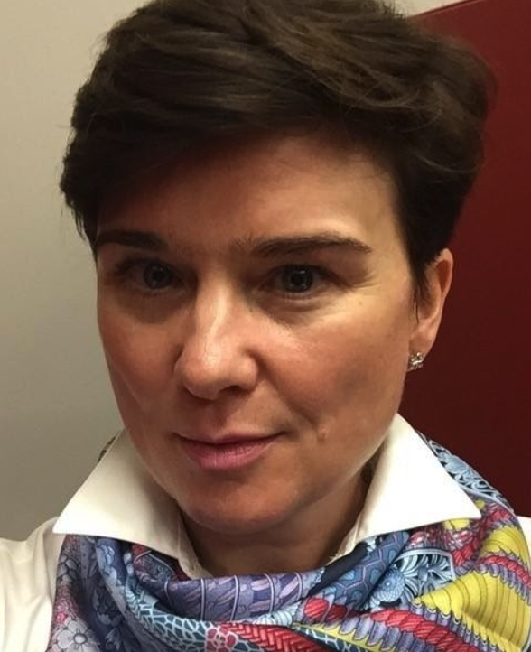
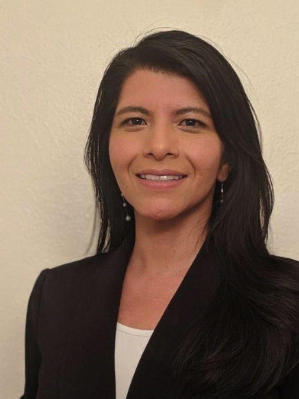

	

		<article itemscope itemtype="http://schema.org/Article">
			<header>

				

					

					<h1>Keynotes</h1>
          <h2>Wednesday, September 8 at 8:00 AM PT</h2>
          

          

            Experiments in the Edge to Cloud Continuum 
            Kate Keahey 
            University of Chicago, Argonne National Laboratory 
          

          
 

          <h3 id="abstract">Abstract</h3>
          

            The increasing popularity of IoT devices allows us to communicate better, interact better, and ultimately build a new type of a scientific instrument that will allow us to explore our environment in ways that we could only dream about just a few years ago. This disruptive opportunity however raises a new set of challenges: how should we manage the massive amounts of data and network traffic such instruments will eventually produce? What types of environments will be most suited to developing their full potential? What new security problems will arise? And finally, what are the best ways of leveraging intelligent edge to create new types of applications?
          

            In a research area that creates its own new reality, such questions are too often approached only theoretically for lack of a realistic testbed, a scientific instrument that keeps pace with the emergent requirements of science and allows researchers to deploy, measure, and analyze relevant scientific hypotheses. The NSF-funded Chameleon testbed, originally created to provide a platform for exploration of research topics in cloud computing -- such as design of new virtualization solutions, operating systems, or power management -- has now been extended to support experiments in cloud to edge.
          

            In this talk, I will first describe the Chameleon testbed — a scientific instrument for computer science systems research, originally created to allow exploration of research topics in cloud computing such as virtualization, programmable networking, or power management --  as well as its recent extensions to support experimentation at the edge. I will describe the testbed capabilities required to provide a platform for the edge to cloud continuum, and give examples of edge to cloud research and education projects our users are running. Finally, I will describe tools and methodologies that Chameleon provides to improve experimental methodology and reproducibility of experiments in this environment and illustrate how a common experimentation platform can enhance sharing and scientific productivity.
          

          <h3 id="biography">Biography</h3>
          

            Kate Keahey is one of the pioneers of infrastructure cloud computing. She created the <a href="http://www.nimbusproject.org/" target="_blank">Nimbus project</a>, recognized as the first open source Infrastructure-as-a-Service implementation, and continues to work on research aligning cloud computing concepts with the needs of scientific datacenters and applications. To facilitate such research for the community at large, Kate leads the <a href="http://www.chameleoncloud.org/" target="_blank">Chameleon project</a>, providing a deeply reconfigurable, large-scale, and open experimental platform for Computer Science research. To foster the recognition of contributions to science made by software projects, Kate co-founded and serves as co-Editor-in-Chief of the <a href="http://www.journals.elsevier.com/softwarex/" target="_blank">SoftwareX journal</a>, a new format designed to publish software contributions. Kate is a Scientist at Argonne National Laboratory and a Senior Fellow at the Computation Institute at the University of Chicago.
          

          <h2>Thursday, September 9 at 12:40 PM PT</h2>
          

          

            Translational Research in Cluster Computing 
            David Abramson 
            University of Queensland 
          

          
 

          <h3 id="abstract">Abstract</h3>
          

            Given the increasingly pervasive role and growing importance of computing and data in all aspects of science and society fundamental advances in computer science and their translation to the real world have become essential. Consequently, there may be benefits to formalizing translational computer science (TCS) to complement the traditional foundational and applied modes of computer science research, as has been done for translational medicine. TCS has the potential to accelerate the impact of computer science research overall. In this talk I discuss the attributes of TCS, and formally define it. I enumerate a number of roadblocks that have limited its adoption to date and sketch a path forward. Finally,  I will provide some specific examples of translational research in parallel and distributed computing, drawing on personal research and also of others in the field.
          

          <h3 id="biography">Biography</h3>
          

            David has been involved in computer architecture and high performance computing research since 1979. He has held appointments at Griffith University, CSIRO, RMIT and Monash University. Prior to joining UQ, he was the Director of the Monash e-Education Centre, Science Director of the Monash e-Research Centre, and a Professor of Computer Science in the Faculty of Information Technology at Monash. From 2007 to 2011 he was an Australian Research Council Professorial Fellow.
          

            David has expertise in High Performance Computing, distributed and parallel computing, computer architecture and software engineering. He has produced in excess of 200 research publications, and some of his work has also been integrated in commercial products. One of these, Nimrod, has been used widely in research and academia globally, and is also available as a commercial product, called EnFuzion, from Axceleon.  His world-leading work in parallel debugging is sold and marketed by Cray Inc, one of the world's leading supercomputing vendors, as a product called ccdb. David is a Fellow of the Association for Computing Machinery (ACM), the Institute of Electrical and Electronic Engineers (IEEE), the Australian Academy of Technology and Engineering (ATSE), and the Australian Computer Society (ACS). From 2016–2019 he was a visiting Professor in the Oxford e-Research Centre at the University of Oxford.
          

          <h2>Friday, September 10 at 8:00 AM PT</h2>
          

          

            Demystifying machine learning in scientific research: a case for embedding domain knowledge in data representation 
            Trilce Estrada 
            University of New Mexico 
          

          
 

          <h3 id="abstract">Abstract</h3>
          

            Over the past years, the use of Artificial Intelligence has become ubiquitous in most disciplines, and Scientific High Throughput applications are not the exception. Machine Learning increasingly plays a central role across the whole workflow pipeline, from workload forecasting, adaptive scheduling, self-managed resource allocation, and on the fly analysis. As we consider a pathway towards reproducible, scalable, and trustworthy science, we must pay special attention to the impact of ML in HTC, and how current practices can advance or hinder these efforts.
          

A common pitfall when designing ML-based solutions is the use of data "as is", and hoping that the models will automatically distill relevant features from the raw input. While this approach is feasible in domains with huge datasets, and no critical need for verifiable and reproducible results, this is a suboptimal approach in science, where data is expensive, very high dimensional, and noisy. This talk shows the power of embedding domain knowledge into the ML cycle, specifically within the data representation of complex entities, such as proteins. The goal of this encoding is to expose intra- and inter-molecular structural patterns to enable scalable and interpretable high throughput analyses. We present use cases in the context of protein function prediction and in-situ analysis of Molecular Dynamics simulations.
          

          <h3 id="biography">Biography</h3>
          

            Trilce Estrada is an associate professor in the department of Computer Science at the University of New México and the director of the Data Science Laboratory. Her research interests span the intersection of Machine Learning, High Performance Computing, Big Data, and their applications to interdisciplinary problems in science and medicine. Estrada received an NSF CAREER award for her work on in-situ analysis and distributed machine learning. Her work for Accurate Scoring of Drug Conformations at the Extreme Scale won first place at the 2nd IEEE International Scalable Computing Challenge. She was named the 2019 ACM SIGHPC Emerging Woman Leader in Technical Computing winner. She has been chair of multiple mentoring efforts, reaching over 500 students, including the PhD Forum and Student Program at IPDPS (2014-2018) and the Mentor Protege Program at SC (2019). Dr. Estrada obtained a PhD in Computer Science from the University of Delaware, M.S in Computer Science from INAOE, and a B.S in Informatics from Universidad de Guadalajara, Mexico.
          

				

			</header>

		</article>
	
<!-- /.medium-8.columns -->

<!-- /.row -->

